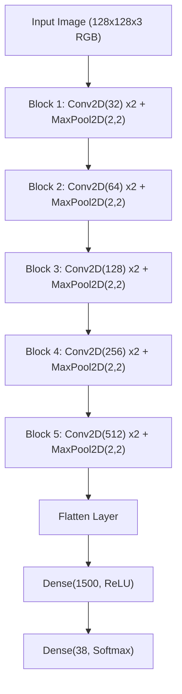

# 🌿 PlantGuard AI: Crop Pathology Diagnostics & Advisory

[](https://share.streamlit.io)
[](https://tensorflow.org)
[](https://python.org)
[]()

An end-to-end Deep Learning Computer Vision solution for automated plant leaf disease diagnosis and agronomic treatment recommendation across **38 classes** and **14 crop species**.

---

## 🌟 Key Highlights

- **94.0% Validation Accuracy** & **0.94 Weighted F1-Score** on 17,572 validation samples.
- **Trained on 87,907 images** from the benchmark PlantVillage dataset.
- **Deep 5-Block CNN Architecture** with over 6.5M parameters optimized via Adam (`lr=1e-4`).
- **Interactive Streamlit Web Dashboard** featuring:
  - 🔬 **Real-time leaf diagnosis** via photo upload or sample leaf selector.
  - 📋 **Agronomic action guides** with pathogen etiology, symptoms, and actionable treatment protocols.
  - 📊 **Training metrics & architecture inspector** visualizing epoch loss and accuracy trends.
  - 📖 **Disease Encyclopedia** covering all 38 supported crop conditions.

---

## 🏗️ Deep Convolutional Architecture



---

## 📁 Repository Structure

```text
├── app.py                      # Main Streamlit web application
├── disease_info.py             # 38-class metadata, causes & treatment recommendations
├── trained_model.keras         # Saved deep learning model (31.4 MB)
├── training_hist.json          # 10-epoch training & validation history
├── sample_images/              # Curated test images for instant one-click demo
├── requirements.txt            # Lightweight production dependencies for cloud deployment
├── .gitignore                  # Prevents pushing bulky 88k raw datasets to GitHub
├── Plant_disease_detection.ipynb # Complete training pipeline notebook
└── Test_Plant_Disease.ipynb    # Inference testing notebook
```

---

## 🚀 Running Locally

### 1. Clone the repository
```bash
git clone https://github.com/<your-username>/plant-disease-detection.git
cd plant-disease-detection
```

### 2. Create and activate a virtual environment
```bash
python3.10 -m venv .venv
source .venv/bin/activate  # On Windows: .venv\Scripts\activate
```

### 3. Install dependencies
```bash
pip install -r requirements.txt
```

### 4. Launch the Streamlit App
```bash
streamlit run app.py
```

The app will open automatically in your browser at `http://localhost:8501`.

---

## ☁️ Deploying to Streamlit Cloud (Free Hosting)

1. Create a public repository on GitHub (e.g., `plant-disease-detection`).
2. Push your project code (`app.py`, `disease_info.py`, `trained_model.keras`, `sample_images/`, `requirements.txt`).
3. Visit [share.streamlit.io](https://share.streamlit.io) and log in with your GitHub account.
4. Click **New app**, select your repository, set the main file path to `app.py`, and click **Deploy**.
5. Within 2-3 minutes, your live web app link is ready to share with recruiters and interviewers!
